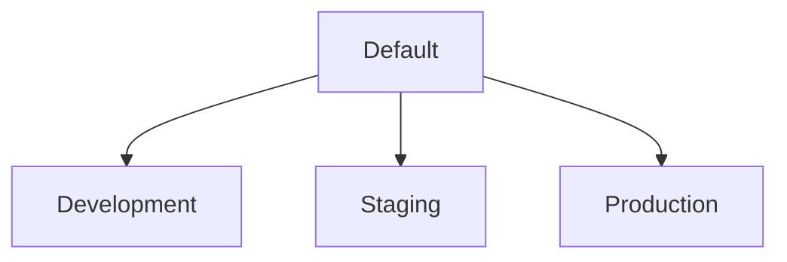

# 🧑🏽‍💻 Project: `Lorentz`

[](https://opensource.org/licenses/BSD-3-Clause) [](https://github.com/zatarain/lorentz/actions/workflows/provisioning.yml) [](https://github.com/zatarain/lorentz/actions/workflows/provisioning.yml) [](https://github.com/zatarain/lorentz/actions/workflows/provisioning.yml)
[](https://github.com/zatarain/lorentz/actions/workflows/provisioning.yml)

This repository aims to hold an infrastructure as code project to define and provision the `ether`-structure for my personal projects. Its name comes after [Hendrik Lorentz][hendrik-lorentz] who was a Dutch physics and his Ether Theory, which also gives the name to the Ethernet standard for Networks (yes, this is yet another nerdy reference from me).

## 🗂️ Table of content

* 🔭 [Overview](#-overview)
  * 🧩 [Structure](#-structure)
  * 💭 [Assumptions](#-assumptions)
* 🪄 [Setup and Orchestration](#-setup-and-orchestration)
* 🚀 [Provisioning](#-provisioning)
* 📚 [References](#-references)

## 🔭 Overview

The infrastructure is defined using [Hashicorp Configuration Language][hcl-docs] and can be provisioned to [Amazon Web Services][aws-docs] using [Terraform][terraform]. The repository is designed to use multiple AWS accounts, such as development and production accounts.

### 🧩 Structure

The code in the repository is designed to have at least two Terraform workspaces. In particular I am using four workspaces each of them linked to my AWS accounts and three of them linked to GitHub environments (sharing the same name):

* **Default**. It holds resources that cannot be replicated or must be shared between the other accounts (e. g. registered domain name, the Terraform state, etc).
* **Development**. It holds the resources for development and the ones I use from my local machine, so its quite unstable.
* **Staging**. This workspace is more stable than development and it's used to test with similar data as production.
* **Production**. It holds the live resources and data for my personal projects.

Following diagrams shows this structure:



The Terraform back-end state for all the accounts is within an AWS S3 bucket and the state locking to prevent raise conditions is managed by a DynamoDB table, both within the Default account. The initial idea was that every account had its own S3 bucket and DynamoDB table; however, this was not possible to initialise with Terraform.

### 💭 Assumptions

Following assumptions were taken:

* We will keep the AWS Account IDs as secret and parametrisable.
* Users and Roles are pre-configured to have access to AWS and create resources.
* There is a user for GitHub Actions that meets previous requirement.

## 🪄 Setup and Orchestration

In order to develop with this repository it's required to have installed terraform and AWS CLI. Then, configure credentials for an [Identity and Access Management][what-is-iam] user who can assume a role that have  enough permissions to create resources on the AWS Development Account. The configuration can be performed with:

```sh
aws configure
```

Following environment variables setup:

* `AWS_REGION`: Region for AWS in which the infrastructure will live.
* `TF_VAR_AWS_ENV_ID`: AWS Account ID for development environment.
* `TF_VAR_AWS_ROOT_ID`: AWS Account ID for the default account.
* `AWS_ACCESS_KEY_ID`: AWS access key for a IAM user.
* `AWS_SECRET_ACCESS_KEY`: AWS secret access key for the same IAM user.

Then, the Terraform back-end can be initialised with following command:

```sh
terraform init -backend-config back-end/default.tfvars
```

Make sure you add `development` profile to `~/.aws/config` file. It should look similar like following:

```ini
[default]
region = eu-west-1
output = json

[profile development]
role_arn = arn:aws:iam::<DEVELOPMENT-ACCOUNT-ID>:role/your-user
source_profile = default
```

Run following command to change to the development workspace:

```sh
terraform workspace select development
```

## 🚀 Provisioning

There is a [pipeline][action-provisioning] already set up in [GitHub Actions][lorentz-actions] to provision the infrastructure to the correspondent environment. The pipeline is triggered on every push or pull request sync, it basically does following depending on the branch name:

* `development`: Apply infrastructure changes to development account.
* `staging`: Apply infrastructure changes to staging account.
* `main`: Apply infrastructure changes to production account **and default account**.
* `any other branch`: Only lint, validates and generate plan for infrastructure changes.

## 📚 References

* [Amazon Web Services][aws-docs]
* [Hashicorp Configuration Language][hcl-docs]
* [GitHub Actions][github-actions-docs]

---

[hendrik-lorentz]: https://en.wikipedia.org/wiki/Hendrik_Lorentz
[terraform]: https://www.terraform.io
[aws-docs]: https://docs.aws.amazon.com
[what-is-iam]: https://docs.aws.amazon.com/IAM/latest/UserGuide/introduction.html
[hcl-docs]: https://developer.hashicorp.com/terraform/language
[lorentz-actions]: https://github.com/zatarain/lorentz/actions
[action-provisioning]: https://github.com/zatarain/lorentz/blob/main/.github/workflows/provisioning.yml
[github-actions-docs]: https://docs.github.com/en/actions
